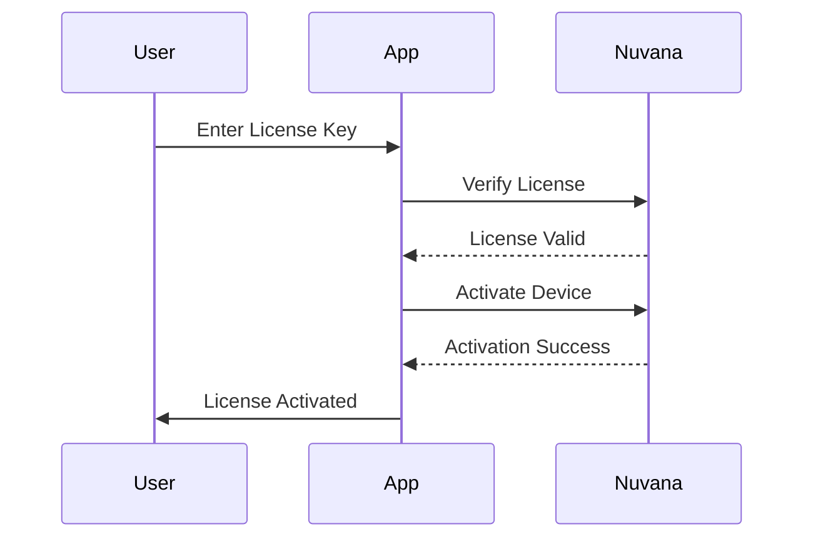

# Nuvana Licensing Integration Guide

## Overview
SimplePOS Electron now integrates with Nuvana Licensing API for comprehensive license management. This replaces the previous local license generation system with a cloud-based solution that provides better security, activation tracking, and management capabilities.

## Key Features

### 🔐 Security
- **HMAC-SHA256 Signatures**: All API requests are signed for authenticity
- **Device Fingerprinting**: Unique device identification prevents license sharing
- **Offline Certificate Verification**: Ed25519 cryptographic verification for offline mode
- **Clock Tamper Detection**: Prevents system clock manipulation

### 📊 Management
- **Multiple Activations**: Support for multiple device activations per license
- **Activation Tracking**: Monitor all active devices using the license
- **Heartbeat Monitoring**: Regular check-ins to verify license validity
- **Grace Period**: 7-day grace period after license expiration

### 🎯 Plans & Features
- **Trial**: 30-day trial with limited features
- **Monthly**: Basic features for small businesses
- **Quarterly**: Advanced features for growing businesses
- **Annual**: Full features with unlimited usage

## Configuration

### 1. Environment Variables
Create a `.env` file based on `.env.example`:

```bash
# Nuvana API Configuration
NUVANA_LICENSE_URL=https://licensing.nuvanasolutions.in
NUVANA_PRODUCT_CODE=SIMPLEPOS-ELECTRON
NUVANA_SECRET=your-secret-key-here
NUVANA_PUBLIC_KEY=base64:your-public-key-here
```

### 2. Get Your Credentials
1. Sign up at [Nuvana Licensing](https://licensing.nuvanasolutions.in)
2. Create a new product and note your Product Code
3. Copy your Secret Key (keep it secure!)
4. Get your Public Key for offline verification

## Implementation Details

### Files Modified/Created

#### New Files
- `src/main/services/nuvana-license-client.ts` - Nuvana API client
- `src/main/services/nuvana-license-service.ts` - License service with Nuvana integration
- `test-nuvana-license.js` - Test suite for Nuvana integration

#### Modified Files
- `src/main/handlers/license-handlers.ts` - Updated to use Nuvana service
- `src/main/database.ts` - Added Nuvana-specific fields to license_state table
- `src/shared/types.ts` - Updated LicenseState interface
- `src/preload/preload.ts` - Added new license API methods

### Database Schema Changes

Added new fields to `license_state` table:
```sql
license_key TEXT,          -- Nuvana license key
customer_email TEXT,       -- Customer email
activation_id TEXT,        -- Current activation ID
offline_certificate TEXT   -- Offline certificate for backup
```

## API Methods

### Client-Side (Renderer)

```javascript
// Activate a license
const result = await window.posAPI.license.activate('LICENSE-KEY-HERE');

// Get license info
const info = await window.posAPI.license.getInfo();

// Check if feature is available
const hasFeature = await window.posAPI.license.checkFeature('advancedReports');

// Deactivate license
await window.posAPI.license.deactivate();

// Start trial
await window.posAPI.license.startTrial();
```

### Server-Side (Main Process)

```typescript
import { nuvanaLicenseService } from './services/nuvana-license-service';

// Activate license
const result = await nuvanaLicenseService.activateLicense(licenseKey);

// Get license info
const info = await nuvanaLicenseService.getLicenseInfo();

// Check feature availability
const available = await nuvanaLicenseService.isFeatureAvailable('installments');

// Issue new license (admin only)
const { licenseKey } = await nuvanaLicenseService.issueLicense(
  'Customer Name',
  'customer@email.com',
  3 // max activations
);
```

## Testing

### Run Test Suite
```bash
# Set your credentials in environment
export NUVANA_SECRET=your-secret-key
export NUVANA_PRODUCT_CODE=your-product-code

# Run tests
node test-nuvana-license.js
```

### Test Coverage
The test suite covers:
- License issuance
- License verification
- Device activation
- Heartbeat sending
- Activation listing
- Offline certificate generation
- License deactivation
- License revocation

## License Lifecycle

### 1. Trial Mode
- Automatically starts on first launch
- 30-day duration
- Limited features (2 users, 100 orders max)
- No export capabilities

### 2. License Activation


### 3. Daily Operations
- **Heartbeat**: Sent every 24 hours to maintain activation
- **Online Verification**: Performed hourly when possible
- **Offline Mode**: Falls back to offline certificate when no internet

### 4. Expiration & Grace Period
- **Warning**: Shows 7 days before expiration
- **Grace Period**: 7 days after expiration with limited features
- **Full Expiration**: App enters read-only mode

## Error Handling

### Common Errors

| Error Code | Description | Solution |
|------------|-------------|----------|
| `license_not_found` | Invalid license key | Check license key format |
| `max_activations_reached` | Too many devices | Deactivate unused devices |
| `expired` | License expired | Renew license |
| `revoked` | License revoked | Contact support |
| `activation_not_found` | Device not activated | Re-activate device |
| `bad_signature` | Invalid API signature | Check secret key |

### Offline Scenarios
When offline, the app:
1. Uses cached license information
2. Validates using offline certificate
3. Allows operation for up to 30 days
4. Queues heartbeats for later sending

## Security Best Practices

### 1. Protect Your Secret Key
- Never commit to version control
- Use environment variables
- Rotate regularly if compromised

### 2. Device Security
- Each device has unique fingerprint
- Based on hardware + OS information
- Prevents license sharing

### 3. Clock Tamper Protection
- Tracks monotonic time
- Detects system clock rollback
- Invalidates license on tampering

## Migration from Old System

### For Existing Users
1. Export debug info from old system
2. Contact support for migration assistance
3. Receive new Nuvana license key
4. Activate in app

### Data Preserved
- Customer information
- Order history
- Templates and settings
- User accounts

## Troubleshooting

### License Won't Activate
1. Check internet connection
2. Verify license key format
3. Check activation limit
4. Review error message

### Offline Certificate Issues
1. Ensure public key is configured
2. Check certificate expiration
3. Regenerate if corrupted

### Heartbeat Failures
1. Check network connectivity
2. Verify device is activated
3. Check license validity

## Support

### Documentation
- API Docs: https://licensing.nuvanasolutions.in/#api
- SimplePOS Guide: This document

### Contact
- Technical Issues: Create GitHub issue
- License Issues: Contact Nuvana support
- Migration Help: support@yourbrand.com

## Appendix: Feature Matrix

| Feature | Trial | Monthly | Quarterly | Annual |
|---------|-------|---------|-----------|--------|
| Max Users | 2 | 5 | 10 | Unlimited |
| Max Orders | 100 | 1000 | 5000 | Unlimited |
| Export Data | ❌ | ✅ | ✅ | ✅ |
| Backup | ✅ | ✅ | ✅ | ✅ |
| Multiple Templates | ❌ | ✅ | ✅ | ✅ |
| Installments | ✅ | ✅ | ✅ | ✅ |
| Advanced Reports | ❌ | ❌ | ✅ | ✅ |
| Email Support | ❌ | ✅ | ✅ | ✅ |
| Phone Support | ❌ | ❌ | ❌ | ✅ |
